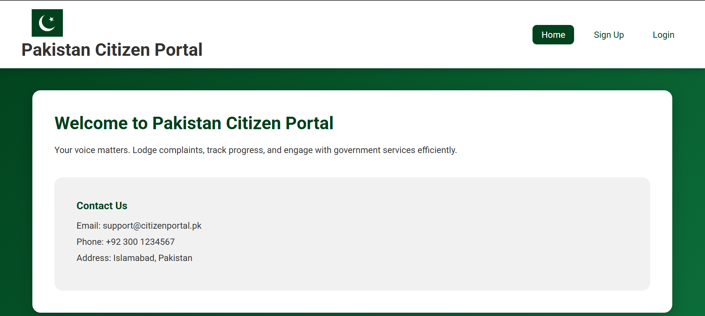
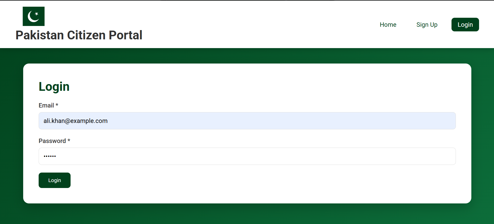
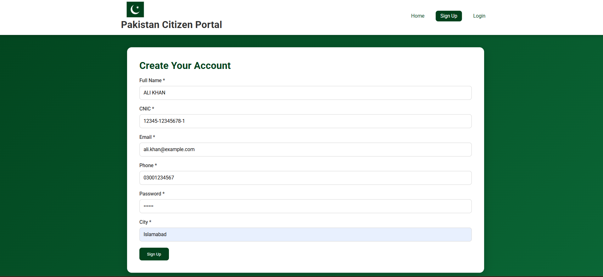
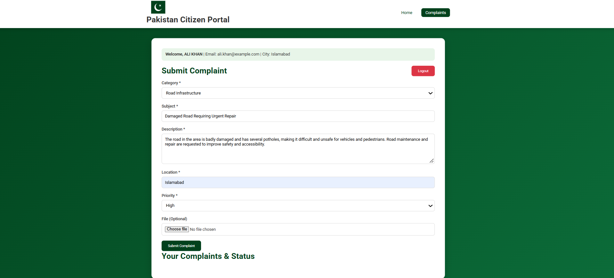
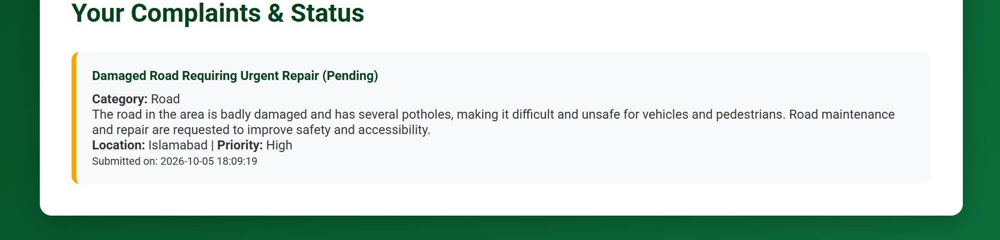

# Citizen Portal

A PHP and MySQL-based citizen complaint management portal that allows users to register, log in, submit complaints, upload supporting files, and track complaint status.

## Overview

Citizen Portal is a web-based complaint management system developed using PHP and MySQL. It provides users with a simple platform to report public issues by submitting complaints with relevant information such as category, subject, description, priority, and location.

The project demonstrates practical implementation of user authentication, session management, form processing, file uploads, MySQL database connectivity, and database-driven complaint status management.

## Features

- User registration and login
- User authentication and session management
- Complaint submission
- Complaint categorization
- Complaint priority selection
- Subject, description, and location details
- Supporting file uploads
- Complaint status tracking
- Pending and Resolved complaint statuses
- MySQL database integration
- User-friendly web interface

## Technologies Used

- PHP
- MySQL
- HTML5
- CSS3
- XAMPP

## Project Structure

- `.gitignore`
- `index.php`
- `citizen_portal.sql`
- `uploads/`
  - `.gitkeep`
- `screenshots/`
  - `home.png`
  - `login.png`
  - `signup.png`
  - `complaint-form.png`
  - `complaint-status.png`

## How It Works

1. A user creates an account through the registration form.
2. The user logs into the portal using their credentials.
3. The user submits a complaint by providing the category, subject, description, priority, and location.
4. Supporting files can be uploaded with the complaint.
5. Complaint information is stored in the MySQL database.
6. The complaint status is maintained in the database as Pending or Resolved.
7. The updated status is displayed on the website.

## Screenshots

### Home Page

### Login Page

### Sign Up Page

### Complaint Submission Form

### Complaint Status

## Database

The project includes the MySQL database structure in `citizen_portal.sql`.

The database stores information related to:

- Registered users
- Submitted complaints
- Complaint details
- Complaint status
- Uploaded complaint files

## Local Setup

### Requirements

- XAMPP
- PHP
- MySQL
- Web browser

### Installation

1. Clone or download this repository.
2. Place the project folder inside the XAMPP `htdocs` directory.
3. Start Apache and MySQL from the XAMPP Control Panel.
4. Create a MySQL database named `citizen_portal`.
5. Import `citizen_portal.sql` into the database.
6. Open the project in your browser:

`http://localhost:8080/citizen_portal`

> The port number may vary depending on the Apache configuration in your XAMPP installation.

## File Uploads

Uploaded complaint files are stored in the `uploads` directory.

Actual uploaded files are excluded from version control using `.gitignore` to prevent user-specific files from being uploaded to the repository.

The `uploads/.gitkeep` file is included to preserve the required directory structure on GitHub.

## Project Purpose

This project was developed as a practical implementation of PHP and MySQL concepts, with a focus on database-driven web development, authentication, form processing, file handling, and complaint management.

## Future Improvements

- Dedicated administrator dashboard
- Role-based access control
- Improved password security and validation
- Email notifications for complaint status updates
- Complaint search and filtering
- Improved database structure
- Separation of frontend and backend components
- Enhanced user interface and accessibility

## Author

**Emaan Saeed**

Computer Science Student  
UET Taxila

## License

This project is intended for educational and portfolio purposes.
